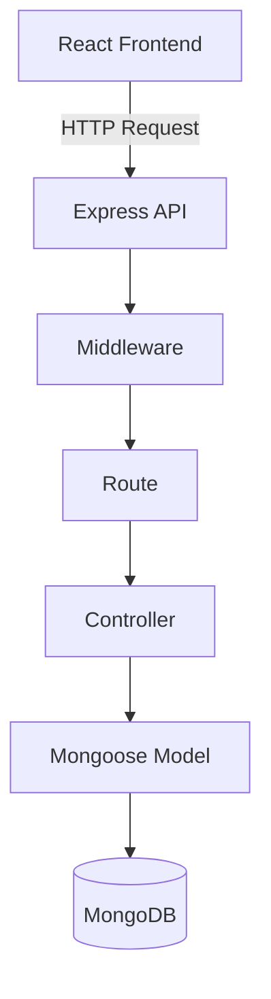
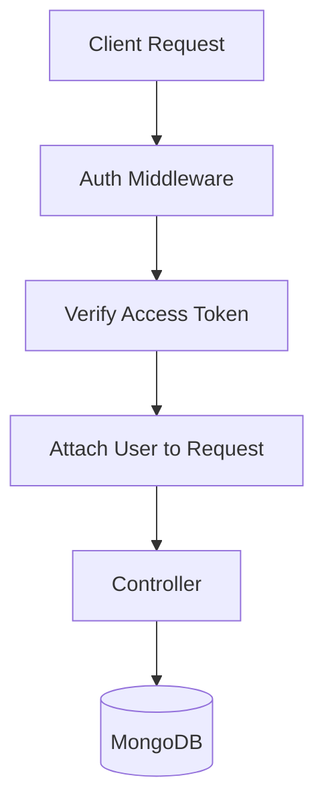
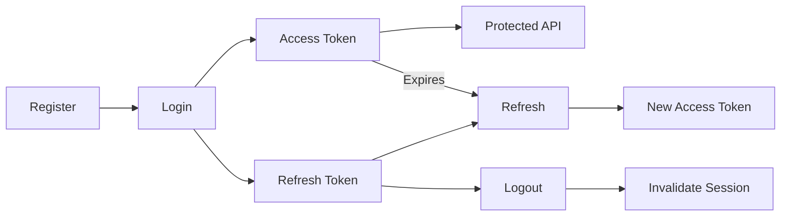
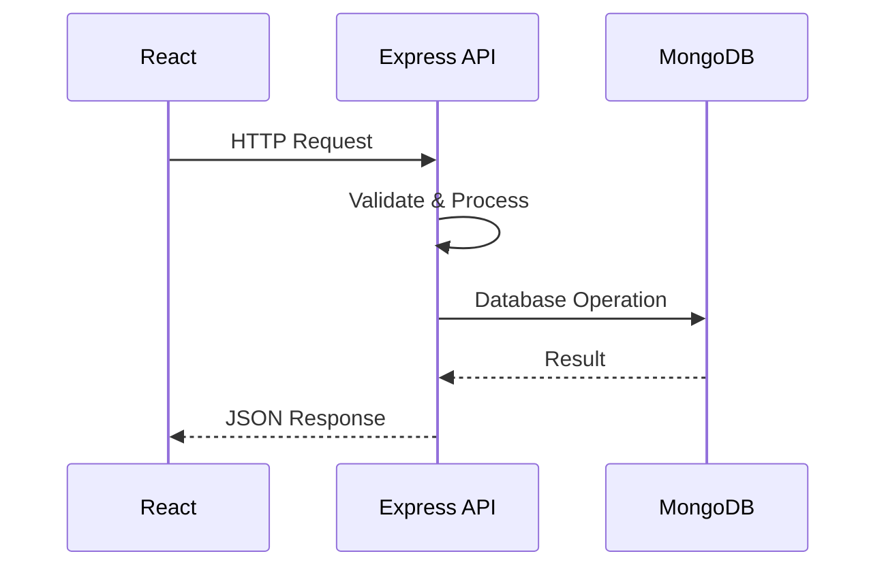

<div align="center">

# 🛍️ SNITCH E-COMMERCE

### A full-stack fashion e-commerce application built from scratch

**Shop &nbsp;•&nbsp; Sell &nbsp;•&nbsp; Build &nbsp;•&nbsp; Learn**

<br>


</div>

---

## About the Project

Snitch is a full-stack fashion e-commerce application being developed from scratch using React, Node.js, Express and MongoDB.

The application is being designed around three main areas:

| Customer | Seller | Platform |
|---|---|---|
| Browse products, manage cart and place orders | Manage products and inventory | Authentication, APIs, database and business logic |

The backend is being developed first. The React frontend will consume the REST APIs provided by the backend.

> **Current status:** The backend foundation is ready and authentication is the next major feature being implemented.

---

## Features

<table>
<tr>
<td width="50%">

### 🔐 Authentication

- User registration
- User login/logout
- JWT access tokens
- Refresh token sessions
- HTTP-only refresh cookie
- Protected routes
- Password hashing with bcrypt
- Refresh token revocation

</td>
<td width="50%">

### 👤 Users & Sellers

- User accounts
- User roles
- Seller authentication
- Seller product management
- Role-based authorization
- Product ownership checks

</td>
</tr>

<tr>
<td width="50%">

### 📦 Products

- Create product
- Product listing
- Product details
- Update product
- Delete product
- Request validation
- Seller ownership

</td>
<td width="50%">

### 🛒 Cart & Orders

- Add to cart
- Update quantity
- Remove product
- Cart total
- Create orders
- Order history
- Order/payment status

</td>
</tr>
</table>

---

## Tech Stack

### Backend

| Technology | Purpose |
|---|---|
| Node.js | JavaScript runtime |
| Express.js | REST API |
| MongoDB Atlas | Database |
| Mongoose | MongoDB ODM |
| JWT | Authentication |
| bcrypt | Password hashing |
| express-validator | Request validation |
| cookie-parser | Cookie handling |
| Helmet | Security headers |
| CORS | Cross-origin requests |
| express-rate-limit | Rate limiting |
| dotenv | Environment configuration |

### Frontend

| Technology | Purpose |
|---|---|
| React | User interface |
| React Router | Client-side routing |
| Axios | API communication |
| CSS | Styling |

### Development

Git • GitHub • VS Code • Nodemon • Postman

---

## Project Structure

```text
snitch-ecommerce/
│
├── backend/
│   ├── src/
│   │   ├── app/
│   │   │   └── app.js
│   │   │
│   │   ├── config/
│   │   │   └── db.js
│   │   │
│   │   ├── middlewares/
│   │   │
│   │   ├── modules/
│   │   │   ├── auth/
│   │   │   ├── user/
│   │   │   ├── product/
│   │   │   ├── cart/
│   │   │   └── order/
│   │   │
│   │   ├── utils/
│   │   │
│   │   └── server.js
│   │
│   ├── .env.example
│   ├── package.json
│   └── package-lock.json
│
├── frontend/
│
├── .gitignore
└── README.md
```

### Feature-based structure

Related code is kept inside the module it belongs to instead of putting every model, controller and route into large global folders.

Example:

```text
modules/
└── product/
    ├── product.model.js
    ├── product.controller.js
    ├── product.routes.js
    └── product.validator.js
```

This keeps each feature easier to find, understand and maintain.

---

## Backend Architecture

The backend follows a simple request flow:



For protected routes:



The frontend never connects directly to MongoDB. Database operations are handled by the backend.

---

## Authentication

### API Endpoints

| Method | Endpoint | Purpose | Access |
|---|---|---|---|
| `POST` | `/api/auth/register` | Create account | Public |
| `POST` | `/api/auth/login` | Login | Public |
| `POST` | `/api/auth/refresh-token` | Get new access token | Refresh token |
| `POST` | `/api/auth/logout` | End session | Authenticated |
| `GET` | `/api/auth/me` | Get current user | Authenticated |

### Token Strategy

The application uses two tokens with different responsibilities.

**Access token**

- Short-lived
- Used for protected API requests
- Sent using the `Authorization` header

```http
Authorization: Bearer <access-token>
```

**Refresh token**

- Longer-lived
- Used to obtain a new access token
- Stored in an HTTP-only cookie
- Tracked server-side so it can be revoked

### Authentication Flow



Passwords are hashed using bcrypt and are never stored as plain text.

---

## User Roles

The application is designed around two main roles:

```text
user
seller
```

Authentication answers:

> Who is this user?

Authorization answers:

> What is this user allowed to do?

For example, being logged in does not automatically give a user permission to update or delete another seller's products.

---

## Product API

| Method | Endpoint | Description | Access |
|---|---|---|---|
| `POST` | `/api/products` | Create product | Authenticated |
| `GET` | `/api/products` | Get all products | Public |
| `GET` | `/api/products/:id` | Get one product | Public |
| `PUT` | `/api/products/:id` | Update product | Authenticated |
| `DELETE` | `/api/products/:id` | Delete product | Authenticated |

Expected product information includes:

```text
name
description
price
category
images
quantity
seller
createdAt
updatedAt
```

Seller ownership and authorization will be applied as the seller functionality is implemented.

---

## Cart & Order Flow

### Cart

```text
Product
   ↓
Add to Cart
   ↓
Update Quantity
   ↓
Remove Product
   ↓
Checkout
```

The backend will validate product information and quantities instead of trusting totals calculated only by the frontend.

### Order

```text
User
  ↓
Cart
  ↓
Checkout
  ↓
Create Order
  ↓
Payment
  ↓
Order Confirmation
  ↓
Order History
```

An order is expected to contain:

```text
user
products
quantity
price
totalAmount
shippingAddress
paymentStatus
orderStatus
createdAt
updatedAt
```

Cart, order and payment functionality will be implemented after the core authentication and product APIs.

---

## Frontend

The frontend will be built with React and will communicate with the backend through HTTP APIs.

Planned pages include:

- Home
- Product listing
- Product details
- Login
- Register
- Cart
- Checkout
- Orders
- Profile
- Seller dashboard
- Product management

Frontend/backend communication:



---

## Validation & Error Handling

Request validation is handled with `express-validator`.

Validation covers:

- Request body
- URL parameters
- Query parameters
- Email format
- Password requirements
- Required fields
- Product price and quantity
- MongoDB ObjectId

Common HTTP responses:

| Status | Meaning |
|---|---|
| `200` | OK |
| `201` | Created |
| `400` | Bad Request |
| `401` | Unauthorized |
| `403` | Forbidden |
| `404` | Not Found |
| `409` | Conflict |
| `500` | Internal Server Error |

---

## Security

The backend is being built with the following security practices:

- bcrypt password hashing
- Short-lived JWT access tokens
- Refresh token management
- HTTP-only refresh token cookies
- Environment variables for secrets
- Authentication middleware
- Request validation
- MongoDB ObjectId validation
- Helmet
- CORS
- Rate limiting
- Generic authentication error messages

Sensitive configuration such as the MongoDB connection string and JWT secrets is kept outside the repository.

---

## Database

MongoDB Atlas is used as the database and Mongoose is used to define schemas and communicate with MongoDB.

Main data areas:

```text
users
products
carts
orders
```

The corresponding collections are managed through Mongoose models.

---

## Environment Variables

Create a `.env` file inside `backend/`.

```env
PORT=3000

MONGO_URI=your_mongodb_connection_string

ACCESS_TOKEN_SECRET=your_access_token_secret

REFRESH_TOKEN_SECRET=your_refresh_token_secret
```

The actual `.env` file must not be committed to GitHub.

The repository contains `.env.example` without real credentials.

---

## Getting Started

### Requirements

- Node.js
- npm
- Git
- MongoDB Atlas account

### Clone

```bash
git clone https://github.com/umakantatech-eng/snitch-ecommerce.git
cd snitch-ecommerce
```

### Backend

```bash
cd backend
npm install
```

Create `backend/.env`, add the required environment variables, then run:

```bash
npm run dev
```

Backend:

```text
http://localhost:3000
```

### API Base

```text
http://localhost:3000/api
```

---

## API Testing

Postman can be used to test the API before connecting the frontend.

Important cases include:

- Registration
- Duplicate email
- Login
- Invalid credentials
- Protected routes
- Refresh token
- Logout
- Product CRUD
- Validation errors
- Invalid IDs
- Unauthorized requests

---

## Development Workflow

The project is being developed feature by feature:

```text
Requirement
    ↓
Model / Schema
    ↓
Validation
    ↓
Controller
    ↓
Route
    ↓
Middleware
    ↓
API Testing
    ↓
Frontend Integration
```

The goal is to understand and test each feature before moving to the next one.

---

## Current Status

### Completed

- Node.js project setup
- Express setup
- ES Modules
- MongoDB Atlas connection
- Mongoose setup
- Environment configuration
- bcrypt setup
- JWT dependencies
- Cookie parser
- CORS
- Helmet
- express-validator
- express-rate-limit
- Nodemon
- Feature-based project structure
- Initial Git/GitHub setup

### In Progress

- User model
- Authentication
- Registration API
- Login API
- Access token
- Refresh token
- Authentication middleware

### Planned

- Complete authentication flow
- Product CRUD
- Seller authorization
- React frontend
- Cart
- Orders
- Payment integration
- Deployment

---

## Future Features

- Product search
- Product filtering and sorting
- Pagination
- Categories
- Product image upload
- Wishlist
- Multiple shipping addresses
- Seller dashboard
- Order management
- Payment gateway
- Email notifications
- Admin functionality
- Automated tests
- Production logging
- CI/CD

---

## Git Workflow

```bash
git status
git add .
git commit -m "your commit message"
git push origin main
```

Repository:

https://github.com/umakantatech-eng/snitch-ecommerce

---

## Project Goal

The goal is to build a complete e-commerce application while understanding how the frontend, backend, database and authentication system work together.

The project is intentionally being developed incrementally rather than building everything at once.

---

<div align="center">

### Built while learning full-stack development

**React • Node.js • Express • MongoDB**

</div>
